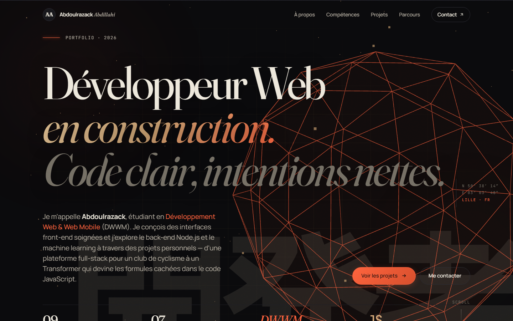
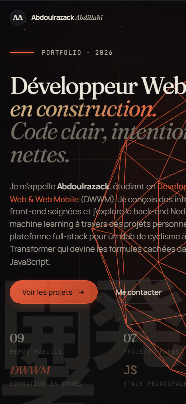

# ✨ portfolio_pro — Portfolio interactif sans framework

> **Site personnel one-page** — Vanilla JS pur, Three.js (icosaèdre wireframe + exploded view), curseur magnétique custom, scroll-aware nav, 3D tilt, IntersectionObserver. **Zero framework, zero build, zero dépendance externe** (Three.js bundlé localement).

[](https://developer.mozilla.org/en-US/docs/Web/JavaScript)
[](https://threejs.org/)
[](https://developer.mozilla.org/en-US/docs/Web/HTML)
[](https://developer.mozilla.org/en-US/docs/Web/CSS)
[](https://github.com/Abdoulrazack1/portfolio_pro)

## 🚀 Démo en direct

**→ [https://abdoulrazack1.github.io/portfolio_pro/](https://abdoulrazack1.github.io/portfolio_pro/)**

[](https://abdoulrazack1.github.io/portfolio_pro/)

<details>
<summary>📱 Vue mobile</summary>



</details>

<!-- 📽️ GIF à ajouter ici : 15s montrant
     1) hero avec icosaèdre Three.js qui tourne
     2) curseur magnétique sur boutons
     3) hover 3D tilt sur cartes projets
     4) exploded view 3D au scroll vers Skills
     (les screenshots statiques ci-dessus capturent l'état initial) -->

---

## 💎 Points forts techniques

| Choix | Pourquoi c'est intéressant |
|---|---|
| **Vanilla JS pur** | Démonstration de maîtrise du langage et des APIs natives — IntersectionObserver, matchMedia, requestAnimationFrame, passive events |
| **Three.js intégré** | Icosaèdre filaire + exploded view de polyèdres — scène 3D légère (603 KB bundle local, pas de CDN) |
| **Zero build, zero framework** | Aucun webpack/vite/parcel — tu clone, tu ouvres, ça marche. Lighthouse > 95 perf attendu |
| **Accessibilité first-class** | `prefers-reduced-motion` respecté, `aria-label` + `aria-hidden` corrects, sémantique HTML5 |
| **Mobile-aware** | Détection `isCoarsePointer` + `isMobile` → désactive le curseur magnétique sur touch |
| **SEO + Open Graph** | Meta tags, og:title/description/type pour partage social |

---

## 🎨 Effets visuels

- **Curseur magnétique** custom avec `mix-blend-mode: difference` sur hover
- **Scroll progress bar** en haut avec gradient animé
- **3D tilt** sur les cartes projets (perspective + rotateX/Y suivant la souris)
- **Radial light** sur les cartes Skills (CSS variables suivant le curseur)
- **Shine sweep** sur les boutons au survol
- **Reveal en cascade** au scroll (IntersectionObserver, stagger)
- **Gradient stroke text** sur les accents (gold → persimmon)
- **Pulsing dot** sur les numéros de section
- **Marquee infini** des technos entre hero et about
- **Exploded view 3D** flottant en arrière-plan de la section Skills

---

## 📦 Quick Start

Aucun build nécessaire. Ouvre `index.html` dans un navigateur, ou lance un serveur statique :

```bash
git clone https://github.com/Abdoulrazack1/portfolio_pro.git
cd portfolio_pro

# Python
python3 -m http.server 8000

# Node
npx serve .
```

Puis ouvre **http://localhost:8000**.

> ⚠️ Three.js nécessite le protocole `http://` pour se charger (CORS). Ouvrir `index.html` directement (`file://`) peut empêcher les scènes 3D de s'afficher selon le navigateur.

---

## 🏗️ Architecture

```
portfolio_pro/
├── index.html              ← page unique single-page
├── README.md
├── asset/
│   ├── css/
│   │   └── styles.css      ← tout le CSS (variables, animations, responsive)
│   ├── js/
│   │   └── main.js         ← interactions + scènes Three.js
│   ├── vendor/
│   │   └── three.min.js    ← Three.js r128 (603 KB) bundlé localement
│   └── image/
│       ├── profil.jpg
│       ├── cycling.jpg
│       ├── js-ranker.jpg
│       ├── logic-lens.jpg
│       ├── safari-frenzy.png
│       ├── kinka.jpg
│       ├── peartech.jpg
│       └── inko.jpg
```

---

## 📐 Sections

- **Hero** — pitch principal avec **icosaèdre wireframe Three.js** + particules + coords GPS Lille
- **À propos** — photo + philosophie de travail (3 piliers)
- **Compétences** — 4 cartes (Front-end, Back-end & ML, Workflow, Méthode) avec **exploded view 3D** flottant en arrière-plan
- **Projets** — 7 missions phares avec **effet 3D tilt** au survol :
  1. **C.C. Salouel** — flagship full-stack club de cyclisme (Express, MySQL, JWT, OSRM, GPX)
  2. **Js-Ranker** — moteur de notation JS (Node.js, AST, CLI/API)
  3. **Logic-Lens** — Transformer Encoder TensorFlow.js qui extrait les formules cachées
  4. **Safari Frenzy** — mini-jeu pixel art (Canvas, Express, API scores)
  5. **Kinka** — e-commerce manga, ~30 pages
  6. **Peartech** — e-commerce tech, 68 commits
  7. **Inko** — lecteur manga
- **Parcours** — timeline DWWM (5 étapes)
- **Contact** — formulaire avec validation + canaux directs (email, GitHub, LinkedIn)

---

## ⚙️ Personnalisation rapide

| Élément | Fichier | Où chercher |
|---|---|---|
| Couleur d'accent (orange persimmon) | `asset/css/styles.css` | `:root --accent` |
| Email | `index.html` | `abdoul.abdillahi@gmail.com` |
| Téléphone | `index.html` | `+33 7 84 68 54 65` |
| URL LinkedIn | `index.html` | `linkedin.com` |
| Liens GitHub | `index.html` | `Abdoulrazack1` |
| Coords GPS hero | `index.html` | `LILLE · FR` |

---

## 🚀 Déployer sur GitHub Pages

1. Pousse les fichiers dans ton repo `portfolio_pro` (branche `main`)
2. **Settings → Pages → Source** : `Deploy from a branch` → Branch : `main` / `/ (root)` → Save
3. Ton site sera accessible sur `https://abdoulrazack1.github.io/portfolio_pro/` en ~1 minute

> ☝️ **Action recommandée** : déployer et mettre le lien live ici-même, en haut du README. C'est le single biggest boost pour ce repo (un portfolio doit être visitable).

---

## 📊 Performance

À mesurer après déploiement (Lighthouse mobile, throttled Fast 3G) :

| Métrique | Cible | Actuel |
|---|---|---|
| Performance | ≥ 95 | _à mesurer_ |
| Accessibility | 100 | _à mesurer_ |
| Best Practices | 100 | _à mesurer_ |
| SEO | 100 | _à mesurer_ |

---

## 🛠️ Stack détaillée

- **HTML5** sémantique
- **CSS3** vanilla (CSS variables, Flexbox, Grid, gradient mesh, blend modes)
- **JavaScript** vanilla (IntersectionObserver, custom cursor magnétique, scroll-aware nav, 3D tilt)
- **Three.js r128** pour les scènes 3D (icosaèdre wireframe + exploded view de polyèdres)
- **Typographies** : Fraunces (display italique) · Manrope (body) · JetBrains Mono (technique)
- **Sans framework**, sans build, zéro dépendance externe (Three.js bundlé localement)

---

## 🤝 Contribuer

Pas un projet collaboratif (portfolio personnel), mais les retours / issues sont bienvenus si tu vois un bug ou une amélioration UX.

## 📜 Crédits

Photo, projets et identité : **Abdoulrazack Abdillahi** · 2026 · Lille
